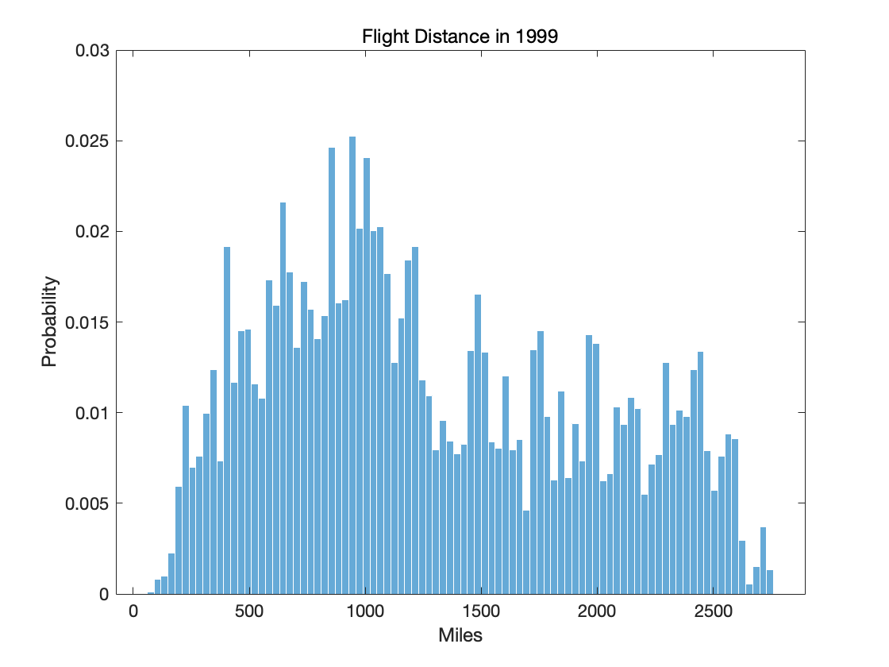
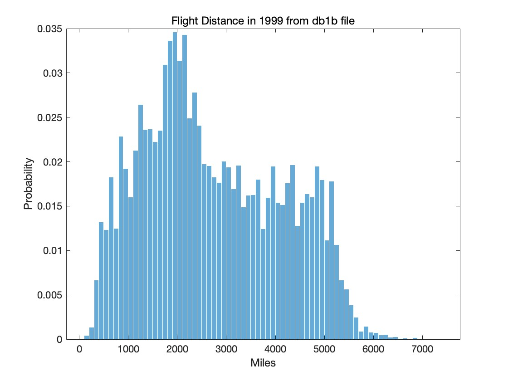

### Replication: Berry and Jia 2010 Tracing the Woes
<p style="text-align: center;">
Tong Li </p>
<p style="text-align: center;">
tong.li1@sciencespo.fr
</p>

==relevant code used in this file are all uploaded via github link below:==
https://github.com/Tli2023/IO_validation_project/tree/main
#### A brief summary of the paper
Berry and Jia (2010) use avian-data from 8 legacy carriers and lcc(new comers) in 1999 and 2006 trying to provide answers to a puzzle where they witness air tranportion indsutry booms with increasing profits, but individually, each legacy carrier was going through financial distress. 

Berry and Jia's main contribution would be providing a comprehensive structural model, which uses a 1) **BLP demand estimation** (inner loop on market shares and outer loop for other parameters) and 2) **a nested-logit model** for the market share. 

Their main findings on the profit losses for legacy carriers are due to the following 3 factors:
  1. Consumers prefer direct flight than connecting flights;
  2. Consumers are more price sensitive;
  3. Supplier side-wise, the cost for connecting flights increases.

#### Part 1: Replication plan:

In this part, we choose to replicate the main program for year 2006, which is the structural model running BLP estimation based on the consumer utility function, market share function. 

In this part, we have 2 loops (fmincon), first stage the inner loop which is the inverted market share function to calculate the unobserved consumer characteristic $ \xi_{jt} $, and in the second stage, we estimate the demand side and supply side paramters with another fmincon. 

We included 2 modifications for the code to run:
```matlab
% use fmincon to refine the search
options=optimset('Display','iter','MaxIter',1000,'MaxFunEvals',1000,'GradObj','on',...
    'DiffMinChange',1e-6,'DerivativeCheck','off'); 
% here we set 'DerivativeCheck','off' to be off, as the fmincon function could not run if we keep the option on;

mex M40_MkSum.c 
% in order for the marker share calculation written in C langauge to be able to run in the fmincon in line 187
```

We now briefly attemp to explain the author's code:
**Part 1:**
From line 8 to line 57, the authors set up the variables from the data tables;

**Part 2:**
From line 59 to line 134, the authors set up the IV matrix, calculate the inverse matrix of the demand and supply side iv. We need the variance covariance matrix and the inverse of the IV to use in the GMM objective function;

**Part 3:**
In this part, the authors run the inner loop (first estimation) inverse market share:
```matlab
[theta, fval,exitflag,output,laglamb,fgrad] = fmincon(@M130_gmmGredMM,theta0,...
    A,b,[],[],lb,ub,[],options,XMat,VM,dM,0)
```
- this is the objective function used for the inner loop, M130_gmmGredMM includes the different modifications the authors have on the model, for example such as including LCCs, delay, grouping 25 airports etc, and it includes both stage of estimations;
- theta0 is the initial value that we assigned for the 1st iteration to run;
- XMat contains the independent variables in our estimation; it includes both demand- and supply-side independent variables;
-  A,b are the linear constraints;
- VM is our IVs;
- dM  is our refined parameters, including number of markets, total obervations etc.
- 0  means the first estimation

Part 4 and 5 calculate the opitmal weight and the variance of the parameters
**Part 6:**
From 1st estimation, we obtained the theta(estimated parameters), now we run the IVGMM objective function to obtain the fitted values:
```matlab
[theta2, fval2,exitflag2,output2,laglamb2,fgrad2] = fmincon(@M130_gmmGredMM,theta,...
    A,b,[],[],lb,ub,[],options,XMat,VM,dM,1)
```
We can see the difference between the first stage and the second stage is in **theta** and **1**; which calls differently in M130_gmmGredMM. 

PS. The replication is shown under the diary file, named as M130_est_tong.txt

#### Part 2a: modification on demand relative to flight distance:

The authors assume demand is decreasing with distance, however, I believe that there should be a kinked-demand curve for long distance haul, as there are no substitutes for long distance travel besides flight especially at the year of 1999. Therefore, the demand should be increasing with distance passing a certain benchmark.

To be more explict, for short to medium haul flights, the American consumers could still prefer self-drive or railroads. However, if we have longer distance flight, such as more than 2500 mi (at least more than 24 hours of driving from LA to Boston), then the business type of consumer has no choice but to fly, implying an inelasticity of demand. 

I first would like to know the numbers of the flights that are more than 2500mi: 
```matlab
load P130_MkDist data
% distribution of the flight distance: 
figure
histogram(distanceproduct, 'Normalization', 'probability', 'EdgeColor', 'white');
title('Flight Distance in 1999');
xlabel('Miles');
ylabel('Probability');
```

We could see indeed from the histogram distribution that this does not look like an unimodal distribution, which confirms our guess of the existence of a kinked demand. 

I make several concessions to test this change in assumption. First, there is a dataframe constraint. The given data has been processed by the authors and they have deliberately removed the precise product characteristics, we do not know the destination, place of transit, and departure of the flight nor flight time. 

Not being able to distinguish the transiting flight at the flight distance file does cause a problem on the inelasticity of demand assumption. A consumer taking a transit flight could infer 2 signals: 1) they are price sensitive, 2) the consumer prefer transit-flight than direct flight for long traveling. Imagine flying from Hawaii to Alaska, (3000mi single-trip), the carrier could offer connecting flight to increase the depature time and arrival time variety, as the directly flight from Hawaii to Alaski may be rarely offered. 

The longest flight distance, as we can see from the table would be aproximately 2700mi. Frankly speaking, as the authors removed  international flights in their data, the inelastic demand assumption is weaking tested in our modification. As cross-continental flights are highly inelastic. 

The change in assumption would be tested in an easier fashion if we are able to have the flying time data. 


Next, we run the code to obtain the product's distance distribution graph via Airline Origin and Destination Survey (DB1B) data. We find the responded products have different distribution to the product data set. The authors did not provide an explaination on why DB1B and market product are different in distance for the same product. 

Secondly, we are not able to filtered the surveyed product's characteristics file (DB1B) as what we have done in the market's product file. A direct filter on the data will lead to dimension errors, then we could not run the fmincon function and process IV invertion.

Our solution would be including 2 dummies to filter out the DB1B side: medium long haul flight be flights between 1500-2500mi; and long haul flight be flights more than 2500mi; 

```matlab
load P130_MkDist data
distanceproduct = data(:,2);
LgDist = distanceproduct >= 1500 & distanceproduct < 2500;
LLgDist = distanceproduct >=2500;
uproduct = unique(data(LLgDist, 1));
numbuproduct = numel(uproduct);
% We have 8682 unique products that have more than 2500 mi of flights;
```

Our modification now applies to the P130 file:
```matlab
%our set of X now includes 2 extra terms that measures variations of distance on price:
XMat=[...,dist,dist2,dist.*LgDist,dist.*LLgDist...];
% Demand IV
Iv1=[..., dist.*LgDist,dist.*LLgDist]
% Supply IV
IV2=[...,...
    ones(nobs,1).*LgDist,dist.*LgDist,nconn.*LgDist,...
    ones(nobs,1).*LLgDist, dist.*LLgDist, nconn.*LLgDist];
```
we changed the iv, LgDist is the medium long haul, and LLgDist is the haul over 2500mi and we added 2 interactive term between distance and long-hauls.

The results are stated as follows: 
|             | parameters      | standard deviation |
|----------------------|-----------------|--------------------|
| fare traveler        | -0.49579        | 0.0047782          |
| traveler connection  | -0.47541        | 0.0075125          |
| traveler constant    | -7.2677         | 0.10471            |
| fare business        | -0.055493       | 0.00059408         |
| business connection  | -0.35955        | 0.0076531          |
| business constant    | -8.7049         | 0.14501            |


Our assumption that demand is inelastic with distance for business consumer, is approximately true. As we can find business consumer's elasticity of demand does fall in between 0 and 1 ==|-0.055493|==, and this is statistically significant. Notice that the original model finds ==|-0.07|==, is also inelastic in increase in fare, but with distance we do see the inelasticness increases with distance; 

Furthermore, when we see the parameters for distance:
|  | parameters  | standard deviation   |
|-----------|-----------|------------|
| Distance   | 0.23122   | 0.039485   |
| Distance squared| -0.065983 | 0.008577   |
| Distance x 1500mi-2500mi | 0.072326  | 0.011547   |
| Distance x 2500mi and above| 0.097409  | 0.019231   |


Compared to the original model, where distance and distance squared are 0.3 and -0.05 respectively, our modification shows that the elasticity does reduce with distance. 

Furthermore, by looking at the specific interactive terms, we do find the demand is increasing with distance, this confirms our hypothesis of the existance of kinked demand for long-haul flights which have no substitute. 

The complete modification is shown under the diary file: P130_distance.txt on github. 

#### Part 2b: modification on the nested logit model
One of the major assumption would be the nested-logit model, I will try to break this assumption by assuming when $\lambda = 1$ in the market share equation, which deduced the model into a multinominal logit. 
```matlab
% first modify the market share equation, which set lambda = 1
function sH=M75_sh(dM)
lamb=1;
grpsh=(tsum.^lamb)./(1+tsum.^lamb);
```
*Caveat*: We are not able to fully remove lambda from all estimation, as the fmincon function needs to have 37 gradiants. Nevertheless, I assume the estimation has to be valid, as the market share equation is now deduced to a multinominal logit form. 

Futhermore, we set all functions under that could be called under @M130_gmmGredMM with dM.lambda=1; 


|                | logit parameters| standard deviation  |
|----------------------|-----------|------------|
| fare traveler        | -0.57503  | 0.020271   |
| traveler connection  | -0.90787  | 0.019941   |
| traveler constant    | -8.057    | 0.090243   |
| fare business        | -0.084046 | 0.0021379  |
| business connection  | -0.43188  | 0.0084406  |
| business constant    | -8.7977   | 0.064208   |

We could confirm that the author's finding on change in demand side is robust under a multinominal logit, as we do see an aversion towards connecting flights for both types of consumers and they are sensitive to price changes. The detailed modification can be find through the diary file:  M130_est_logit_modification.txt